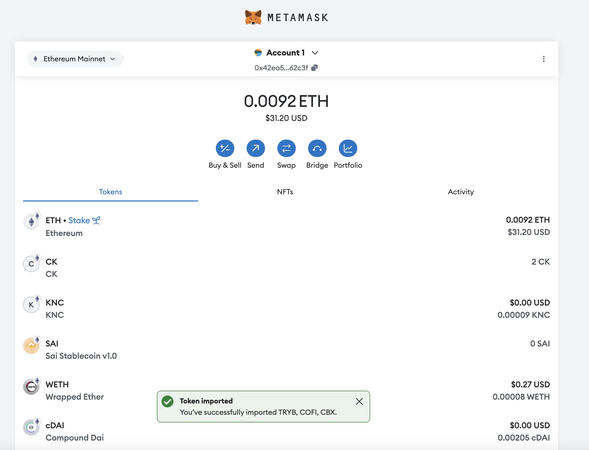
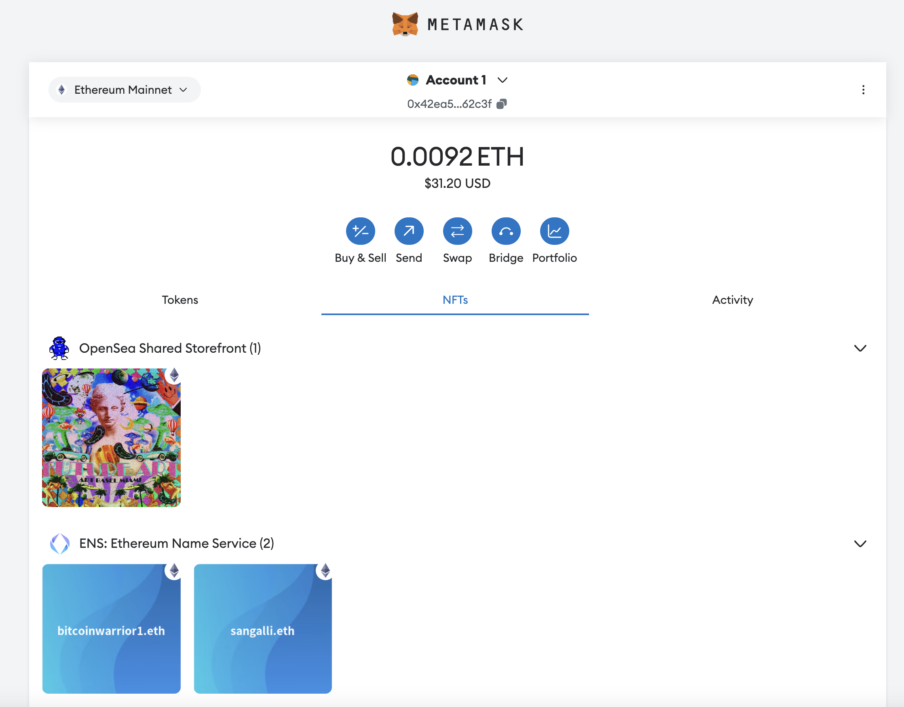

# NFT lending and borrowing

## High Level Overview
The client is looking to build a lending & borrowing platform that enables users to collateralize their NFTs to borrow money. 

## Requirements
The client requires that the following be built.

#### NFTLoans.sol
A smart contract that:
- Enables borrowers to lock up a supported NFT as collateral
- Enables lenders to provide capital 
- Enables an interest rate to be set between a lender and a borrower
- Enables an admin to select eligible NFTs
- Interacts with an external oracle to determine the market value of the NFT being used as collateral
- Enables an admin to set an acceptable collateralisation ratio for loans 
- Enables an admin to approve certain `ERC20` tokens for loans and certain `ERC721` tokens for collateral

#### A web app
The client needs a web app that:
- Interacts with web3 enabled wallets such as `MetaMask` and `WalletConnect`
- Interacts with `NFTLoans.sol` via the web3 provider 
- Can read a user's `ERC20` and `ERC721` balances
- Can retrieve the value of a supported NFT via an oracle contract or third party service 

## Network selection
The client has not specified which EVM chain they wish to use. When considering the right chain, it is important to think about the following.

#### Liquidity
Which chain has the most liquidity for the NFTs and ERC20 tokens you plan to support? The chain with the highest liquidity is the best choice. 

High liquidity chains:
- Ethereum mainnet
- Arbitrum

Low liquidity chains:
- xDAI
- Polygon

Infura supports all major EVM chains. 

#### Fees
How sensitive is your userbase to fees? High value loans and NFTs will be fee insensitive, while lower value loans and NFTs will be more sensitive to fees. The mainnet network typically has the highest fees, and the most transaction volume. 

High fee chains:
- Ethereum mainnet

Low fee chains:
- Arbitrum
- Polygon

#### Decentralisation
How important is decentralisation for your product? Often times, EVM chains that offer low fees have done so at the expense of decentralisation. 

#### Confirmation times 
Do you expect that your dApp will handle a high or low volume of transactions? The higher the volume, the more sensitive to confirmation times.

## Out of scope
- Frontend development
- Smart contract development 

## Services that Consensys can provide 

#### Infura 
No matter what EVM network the client decides to build on, they will require a node to get on chain data. Infura is the most widely used and trusted node provider in the space.

Infura can solve the following:
- Retrieval of `ERC20` and `ERC721` balances 
- Broadcasting of transactions from the user 
- Node queries e.g. smart contract calls & native balance enquires

See `scripts/infura` for more info. 

#### MetaMask Wallet
The MetaMask wallet is the most popular and trusted browser wallet in the space. Most crypto user have had or still have exposure to MetaMask and use it as their primary wallet. 

MetaMask enables:
- Your users to interact with their crypto wallet
- Your website to interact with the wallet via the web3 provider 
- Your users to interact with their `ERC20` and `ERC721` tokens
- Token auto-detection, automatically find users `ERC20` and `ERC721` tokens 

##### Screenshot of an example of ERC20 balances in MM

##### Screenshot of an example of NFT balances in MM

#### Snaps
MetaMask snaps allow you to customise the UX within MetaMask. 

Snaps can do the following for the client:
- Enable custom notifications that are relevant to the user e.g. loan created, tokens received, NFT locked up, etc. 
- Notify a user when their loan is coming to maturity 
